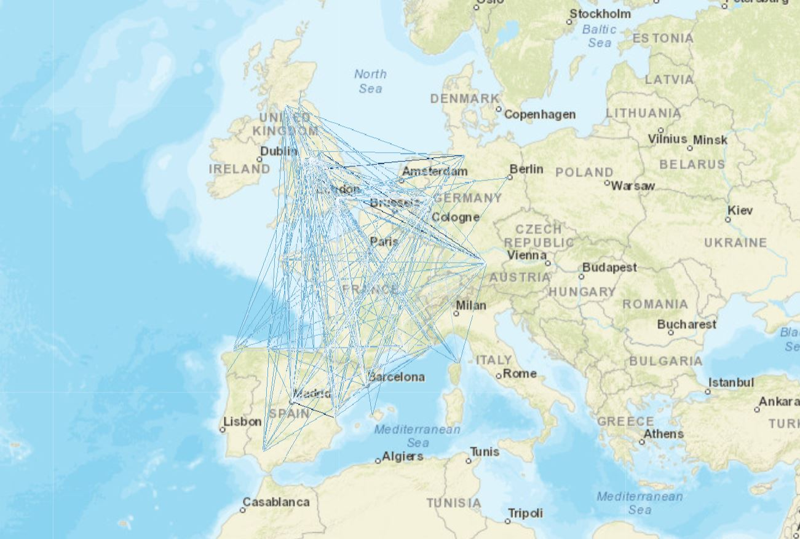
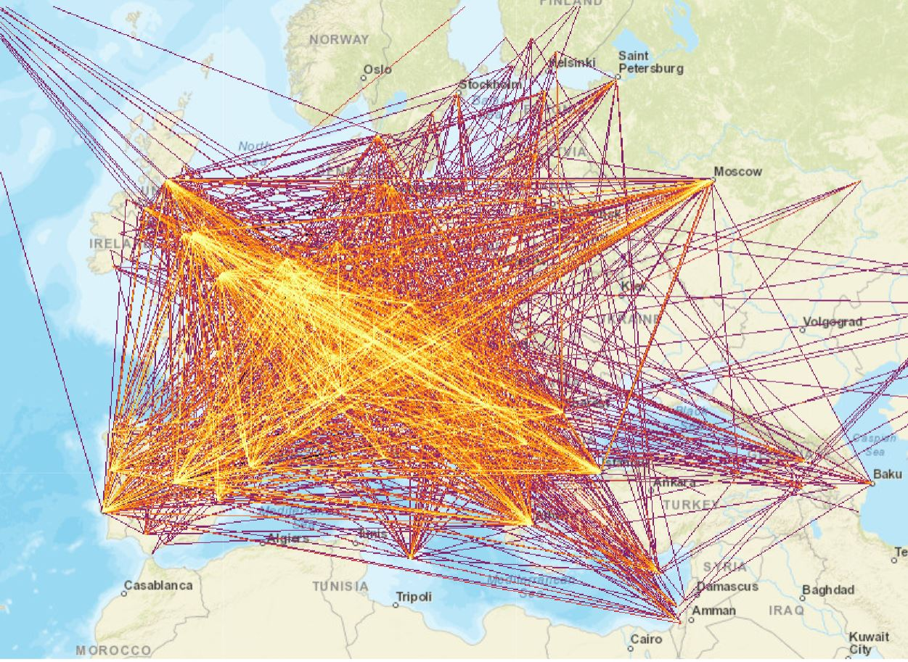

## Visualization of Football Matches using the Lean Startup Method

Visualization is one of the key parts in a Data Science project. It allows us to get a global sense of our data and to understand better our results. 
There are many free and non-free tools in the market to make data visualization. One of my favourites is [datashader](https://github.com/bokeh/datashader), an open source python library that allows to visualize big amounts of data with a clean and nice API. 


```python
#Load all libraries
import os,sys  
import pandas as pd
import numpy as np
import xarray as xr
import datashader as ds
import datashader.transfer_functions as tf
from datashader import reductions
from datashader.colors import colormap_select, Hot, inferno
from datashader.bokeh_ext import InteractiveImage
from bokeh.palettes import Greens3, Blues3, Blues4, Blues9, Greys9
from bokeh.plotting import figure, output_notebook
from bokeh.tile_providers import WMTSTileSource, STAMEN_TONER, STAMEN_TERRAIN
from functools import partial
import wget
import zipfile
import math
from difflib import SequenceMatcher

output_notebook()
#print(sys.path)
print(sys.version)
```


    <div class="bk-root">
        <a href="http://bokeh.pydata.org" target="_blank" class="bk-logo bk-logo-small bk-logo-notebook"></a>
        <span id="d45a39ec-2acc-4013-ae42-92b322795b3e">Loading BokehJS ...</span>
    </div>


    3.5.2 |Anaconda custom (64-bit)| (default, Jul  2 2016, 17:53:06) 
    [GCC 4.4.7 20120313 (Red Hat 4.4.7-1)]


### Visualization of Champions League matches
We can easily create a visualization of the Champion League matches from 1955 to 2016 using datashader. For that we need a dataset of the matches, such as [this one](https://github.com/jalapic/engsoccerdata/blob/master/data-raw/champs.csv) and the coordinates of the Stadiums of the teams, that you can find [here](http://opisthokonta.net/?cat=34). 

The first step is to treat the data.


```python
df_stadium = pd.read_csv("stadiums.csv", usecols=['Team','Stadium','Latitude','Longitude','Country'])
print("Number of rows: %d" % df_stadium.shape[0])
dd1 = df_stadium.take([0,99, 64, 121])
dd1
```

    Number of rows: 164


<div>
<table border="1" class="dataframe">
  <thead>
    <tr style="text-align: right;">
      <th></th>
      <th>Team</th>
      <th>Stadium</th>
      <th>Latitude</th>
      <th>Longitude</th>
      <th>Country</th>
    </tr>
  </thead>
  <tbody>
    <tr>
      <th>0</th>
      <td>Arsenal</td>
      <td>Emirates Stadium</td>
      <td>51.555000</td>
      <td>-0.108611</td>
      <td>England</td>
    </tr>
    <tr>
      <th>99</th>
      <td>Real Madrid</td>
      <td>Santiago Bernabéu</td>
      <td>40.453060</td>
      <td>-3.688350</td>
      <td>Spain</td>
    </tr>
    <tr>
      <th>64</th>
      <td>Bayern Munich</td>
      <td>Allianz Arena</td>
      <td>48.218775</td>
      <td>11.624753</td>
      <td>Germany</td>
    </tr>
    <tr>
      <th>121</th>
      <td>Paris Saint-Germain</td>
      <td>Parc des Princes</td>
      <td>48.841389</td>
      <td>2.253056</td>
      <td>France</td>
    </tr>
  </tbody>
</table>
</div>


The next step is to match the club names in the dataset of coordinates with the those in the dataset of matches. They are similar but not always exactly the same, for example, in the dataset of coordinates we have `Real Madrid FC` and in the dataset of matches we have `Real Madrid`. Furthermore, in the first one there are several entries for some teams, like `Atletico Madrid`, `Atletico Madrid B` or `Atletico Madrid C` meaning they are the teams from the first division and from other divisions. 


```python
df_match = pd.read_csv('champions.csv', usecols=['Date','home','visitor','hcountry','vcountry'])
df_match = df_match.rename(columns = {'hcountry':'home_country', 'vcountry':'visitor_country'})
df_teams_champions = pd.concat([df_match['home'], df_match['visitor']])
teams_champions = set(df_teams_champions)
print("Number of teams that have participated in the Champions League: %d" % len(teams_champions))
print("Number of matches in the dataset: %d" % df_match.shape[0])
df_match.head()
```

    Number of teams that have participated in the Champions League: 502
    Number of matches in the dataset: 6554


<div>
<table border="1" class="dataframe">
  <thead>
    <tr style="text-align: right;">
      <th></th>
      <th>Date</th>
      <th>home</th>
      <th>visitor</th>
      <th>home_country</th>
      <th>visitor_country</th>
    </tr>
  </thead>
  <tbody>
    <tr>
      <th>0</th>
      <td>1955-09-04</td>
      <td>Sporting CP</td>
      <td>Partizan Belgrade</td>
      <td>POR</td>
      <td>SRB</td>
    </tr>
    <tr>
      <th>1</th>
      <td>1955-09-07</td>
      <td>Budapesti Voros Lobogo</td>
      <td>RSC Anderlecht</td>
      <td>HUN</td>
      <td>BEL</td>
    </tr>
    <tr>
      <th>2</th>
      <td>1955-09-08</td>
      <td>Servette Geneve</td>
      <td>Real Madrid</td>
      <td>SUI</td>
      <td>ESP</td>
    </tr>
    <tr>
      <th>3</th>
      <td>1955-09-14</td>
      <td>Rot-Weiss Essen</td>
      <td>Hibernian FC</td>
      <td>GER</td>
      <td>SCO</td>
    </tr>
    <tr>
      <th>4</th>
      <td>1955-09-20</td>
      <td>Djurgardens IF</td>
      <td>Gwardia Warszawa</td>
      <td>SWE</td>
      <td>POL</td>
    </tr>
  </tbody>
</table>
</div>


To find the string similarity you can use different methods. Here we will use a simple method to calculate it with `difflib`.


```python
def similar(a, b):
    return SequenceMatcher(None, a, b).ratio()

def get_info_similar_team(team, df_stadium, threshold=0.6, verbose=False):
    max_rank = 0
    max_idx = -1
    stadium = "Unknown"
    latitude = np.NaN
    longitude = np.NaN
    for idx, val in enumerate(df_stadium['Team']):
        rank = similar(team, val)
        if rank > threshold:
            if(verbose): print("%s and %s(Idx=%d) are %f similar." % (team, val, idx, rank))
            if rank > max_rank:
                if(verbose): print("New maximum rank: %f" %rank)
                max_rank = rank
                max_idx = idx
                stadium = df_stadium['Stadium'].iloc[max_idx]
                latitude = df_stadium['Latitude'].iloc[max_idx]
                longitude = df_stadium['Longitude'].iloc[max_idx]
    return stadium, latitude, longitude
print(get_info_similar_team("Real Madrid FC", df_stadium, verbose=True))
print(get_info_similar_team("Atletico de Madrid FC", df_stadium, verbose=True))
print(get_info_similar_team("Inter Milan", df_stadium, verbose=True))
 
```

    Real Madrid FC and Real Madrid (Idx=99) are 0.923077 similar.
    New maximum rank: 0.923077
    ('Santiago Bernabéu ', 40.453060000000001, -3.6883499999999998)
    Atletico de Madrid FC and Atlético Madrid (Idx=87) are 0.810811 similar.
    New maximum rank: 0.810811
    ('Vicente Calderón ', 40.401719, -3.7206059999999996)
    ('Unknown', nan, nan)


The next step is to create a dataframe relating each match with the stadium coordinates of each team


```python
%%time
df_match_stadium = df_match
home_stadium_index = df_match_stadium['home'].map(lambda x: get_info_similar_team(x, df_stadium))
visitor_stadium_index = df_match_stadium['visitor'].map(lambda x: get_info_similar_team(x, df_stadium))
df_home = pd.DataFrame(home_stadium_index.tolist(), columns=['home_stadium', 'home_latitude', 'home_longitude'])
df_visitor = pd.DataFrame(visitor_stadium_index.tolist(), columns=['visitor_stadium', 'visitor_latitude', 'visitor_longitude'])
df_match_stadium = pd.concat([df_match_stadium, df_home, df_visitor], axis=1, ignore_index=False)
```

    CPU times: user 1min 54s, sys: 112 ms, total: 1min 54s
    Wall time: 1min 54s


```python
print("Number of missing values for home teams: %d out of %d" % (df_match_stadium['home_stadium'].value_counts()['Unknown'], df_match_stadium.shape[0]))
df1 = df_match_stadium['home_stadium'] == 'Unknown'
df2 = df_match_stadium['visitor_stadium'] == 'Unknown'
n_complete_matches = df_match_stadium.shape[0] - df_match_stadium[df1 | df2].shape[0]
print("Number of matches with complete data: %d out of %d" % (n_complete_matches, df_match_stadium.shape[0]))
df_match_stadium.head()
```

    Number of missing values for home teams: 4499 out of 6554
    Number of matches with complete data: 728 out of 6554


<div>
<table border="1" class="dataframe">
  <thead>
    <tr style="text-align: right;">
      <th></th>
      <th>Date</th>
      <th>home</th>
      <th>visitor</th>
      <th>home_country</th>
      <th>visitor_country</th>
      <th>home_stadium</th>
      <th>home_latitude</th>
      <th>home_longitude</th>
      <th>visitor_stadium</th>
      <th>visitor_latitude</th>
      <th>visitor_longitude</th>
    </tr>
  </thead>
  <tbody>
    <tr>
      <th>0</th>
      <td>1955-09-04</td>
      <td>Sporting CP</td>
      <td>Partizan Belgrade</td>
      <td>POR</td>
      <td>SRB</td>
      <td>El Molinón</td>
      <td>43.536111</td>
      <td>-5.637222</td>
      <td>Unknown</td>
      <td>NaN</td>
      <td>NaN</td>
    </tr>
    <tr>
      <th>1</th>
      <td>1955-09-07</td>
      <td>Budapesti Voros Lobogo</td>
      <td>RSC Anderlecht</td>
      <td>HUN</td>
      <td>BEL</td>
      <td>Unknown</td>
      <td>NaN</td>
      <td>NaN</td>
      <td>Unknown</td>
      <td>NaN</td>
      <td>NaN</td>
    </tr>
    <tr>
      <th>2</th>
      <td>1955-09-08</td>
      <td>Servette Geneve</td>
      <td>Real Madrid</td>
      <td>SUI</td>
      <td>ESP</td>
      <td>Unknown</td>
      <td>NaN</td>
      <td>NaN</td>
      <td>Santiago Bernabéu</td>
      <td>40.453060</td>
      <td>-3.688350</td>
    </tr>
    <tr>
      <th>3</th>
      <td>1955-09-14</td>
      <td>Rot-Weiss Essen</td>
      <td>Hibernian FC</td>
      <td>GER</td>
      <td>SCO</td>
      <td>Unknown</td>
      <td>NaN</td>
      <td>NaN</td>
      <td>Easter Road</td>
      <td>55.961667</td>
      <td>-3.165556</td>
    </tr>
    <tr>
      <th>4</th>
      <td>1955-09-20</td>
      <td>Djurgardens IF</td>
      <td>Gwardia Warszawa</td>
      <td>SWE</td>
      <td>POL</td>
      <td>Unknown</td>
      <td>NaN</td>
      <td>NaN</td>
      <td>Unknown</td>
      <td>NaN</td>
      <td>NaN</td>
    </tr>
  </tbody>
</table>
</div>


Now, even though there are many entries in the dataset that don't have any value, we are going to create a dataframe with the teams that do have values and advance in the project. This dataframe finds the combination of teams (home and visitor) that have values and concatenate each other to create the map.


```python
def aggregate_dataframe_coordinates(dataframe):
    df = pd.DataFrame(index=np.arange(0, n_complete_matches*3), columns=['Latitude','Longitude'])
    count = 0
    for ii in range(dataframe.shape[0]):
        if dataframe['home_stadium'].loc[ii]!= 'Unknown' and dataframe['visitor_stadium'].loc[ii]!= 'Unknown':
            df.loc[count] = [dataframe['home_latitude'].loc[ii], dataframe['home_longitude'].loc[ii]]
            df.loc[count+1] = [dataframe['visitor_latitude'].loc[ii], dataframe['visitor_longitude'].loc[ii]]
            df.loc[count+2] = [np.NaN, np.NaN]
            count += 3
    return df
df_agg = aggregate_dataframe_coordinates(df_match_stadium)
df_agg.head()
```


<div>
<table border="1" class="dataframe">
  <thead>
    <tr style="text-align: right;">
      <th></th>
      <th>Latitude</th>
      <th>Longitude</th>
    </tr>
  </thead>
  <tbody>
    <tr>
      <th>0</th>
      <td>53.4631</td>
      <td>-2.29139</td>
    </tr>
    <tr>
      <th>1</th>
      <td>51.4926</td>
      <td>7.45184</td>
    </tr>
    <tr>
      <th>2</th>
      <td>NaN</td>
      <td>NaN</td>
    </tr>
    <tr>
      <th>3</th>
      <td>55.8532</td>
      <td>-4.30926</td>
    </tr>
    <tr>
      <th>4</th>
      <td>43.7233</td>
      <td>7.25876</td>
    </tr>
  </tbody>
</table>
</div>


We have to transform the latitude and longitude coordinates to [web mercator](https://en.wikipedia.org/wiki/Web_Mercator) format in order to be able to represent it in a map using bokeh. Mercator coordinates are a cilindrical projection of the World coordinates. It was invented in 1569 by [Gerardus Mercator](https://en.wikipedia.org/wiki/Mercator_projection) and became the standard format for nautical purposes. The web mercator format is an adaptation of the original mercator format and it is currently used by most modern map systems such as Google Maps, Bing Maps or OpenStreetMaps.


```python
def to_web_mercator(yLat, xLon):
    # Check if coordinate out of range for Latitude/Longitude
    if (abs(xLon) > 180) and (abs(yLat) > 90):  
        return
 
    semimajorAxis = 6378137.0  # WGS84 spheriod semimajor axis
    east = xLon * 0.017453292519943295
    north = yLat * 0.017453292519943295
 
    northing = 3189068.5 * math.log((1.0 + math.sin(north)) / (1.0 - math.sin(north)))
    easting = semimajorAxis * east
 
    return [easting, northing]
df_agg_mercator = df_agg.apply(lambda row: to_web_mercator(row['Latitude'], row['Longitude']), axis=1)
df_agg_mercator.head()
```


<div>
<table border="1" class="dataframe">
  <thead>
    <tr style="text-align: right;">
      <th></th>
      <th>Latitude</th>
      <th>Longitude</th>
    </tr>
  </thead>
  <tbody>
    <tr>
      <th>0</th>
      <td>-255076.256689</td>
      <td>7.069114e+06</td>
    </tr>
    <tr>
      <th>1</th>
      <td>829535.256912</td>
      <td>6.708890e+06</td>
    </tr>
    <tr>
      <th>2</th>
      <td>NaN</td>
      <td>NaN</td>
    </tr>
    <tr>
      <th>3</th>
      <td>-479704.406257</td>
      <td>7.529248e+06</td>
    </tr>
    <tr>
      <th>4</th>
      <td>808041.021713</td>
      <td>5.422726e+06</td>
    </tr>
  </tbody>
</table>
</div>


The next step is to plot the trayectories in the map using datashader


```python
plot_width  = 850
plot_height = 600
x_range = (-1.9e6, 5.9e6)
y_range = (3.7e6, 9.0e6)
def create_image(x_range=x_range, y_range=y_range, w=plot_width, h=plot_height):
    cvs = ds.Canvas(plot_width=w, plot_height=h, x_range=x_range, y_range=y_range)
    agg = cvs.line(df_agg_mercator, 'Latitude', 'Longitude',  ds.count())
    #img = tf.shade(agg, cmap=reversed(Blues3), how='eq_hist')
    img = tf.shade(agg, cmap=inferno, how='eq_hist')
    return img

def base_plot(tools='pan,wheel_zoom,reset',plot_width=plot_width, plot_height=plot_height,**plot_args):
    p = figure(tools=tools, plot_width=plot_width, plot_height=plot_height,
        x_range=x_range, y_range=y_range, outline_line_color=None,
        min_border=0, min_border_left=0, min_border_right=0,
        min_border_top=0, min_border_bottom=0, **plot_args)
    
    p.axis.visible = False
    p.xgrid.grid_line_color = None
    p.ygrid.grid_line_color = None
    
    return p
```


```python
ArcGIS=WMTSTileSource(url='http://server.arcgisonline.com/ArcGIS/rest/services/World_Street_Map/MapServer/tile/{Z}/{Y}/{X}.png')
p = base_plot()
p.add_tile(ArcGIS)
#InteractiveImage(p, create_image)
```


    <bokeh.models.renderers.TileRenderer at 0x7ff089f6e400>


The function `InteractiveImage` is not rendered in github. I made a snapshot and show it here:
<p align="center">

</p>

Now that we have the map, we can start to improve it. If you are into football, you will notice that there are several points in the north of Spain, that corresponds to Sporting de Gijon. Sadly for Sporting supporters, they have never reached to the Champions. Instead, Sporting Clube de Portugal has participated several times in the championship, but since the current dataset doesn't have teams from Portugal, the system mistakenly thinks that `Sporting CP` from `champions.csv` is the Sporting de Gijon from `stadiums.csv`. So lets fix this issue by getting the stadiums coordinates from the rest of the countries in Europe.  
We can get that info from [wikidata](https://query.wikidata.org/). Using `SPARQL` language we can get the information we need:
```SQL
SELECT ?clubLabel ?venueLabel ?coordinates ?countryLabel  WHERE {
  ?club wdt:P31 wd:Q476028.
  ?club wdt:P115 ?venue.
  ?venue wdt:P625 ?coordinates.
  ?club wdt:P17 ?country.
  SERVICE wikibase:label { bd:serviceParam wikibase:language "en". }
}
ORDER BY ?clubLabel
```
This generates 4435 Results in 10111 ms that can be saved to a csv file.


```python
df_stadium_read = pd.read_csv('stadiums_wikidata.csv', usecols=['clubLabel','venueLabel','coordinates','countryLabel'])
df_stadium_read.tail()
```


<div>
<table border="1" class="dataframe">
  <thead>
    <tr style="text-align: right;">
      <th></th>
      <th>clubLabel</th>
      <th>venueLabel</th>
      <th>coordinates</th>
      <th>countryLabel</th>
    </tr>
  </thead>
  <tbody>
    <tr>
      <th>4430</th>
      <td>ŠK SFM Senec</td>
      <td>NTC Senec</td>
      <td>Point(17.410412 48.217703)</td>
      <td>Slovakia</td>
    </tr>
    <tr>
      <th>4431</th>
      <td>ŠK Slovan Bratislava</td>
      <td>Štadión Pasienky</td>
      <td>Point(17.141111 48.166111)</td>
      <td>Slovakia</td>
    </tr>
    <tr>
      <th>4432</th>
      <td>Żurrieq F.C.</td>
      <td>Ta' Qali National Stadium</td>
      <td>Point(14.415372222 35.894863888)</td>
      <td>Malta</td>
    </tr>
    <tr>
      <th>4433</th>
      <td>ŽFK Crvena zvezda</td>
      <td>Red Star Stadium</td>
      <td>Point(20.464914 44.7832)</td>
      <td>Serbia</td>
    </tr>
    <tr>
      <th>4434</th>
      <td>ŽP Šport Podbrezová</td>
      <td>Stadium Kolkáreň</td>
      <td>Point(19.535 48.8167)</td>
      <td>Slovakia</td>
    </tr>
  </tbody>
</table>
</div>


The first step is to clean the column coordinates. For that we will use a regex pattern. The pattern `[-+]?[0-9]*\.?[0-9]+` finds any signed float in a string. Then we create two patterns separated by a space and name the columns using this format: `(?P<Longitude>)`. Finally we have to concatente the club information with the coordinates.


```python
df_temp = df_stadium_read['coordinates'].str.extract('(?P<Longitude>[-+]?[0-9]*\.?[0-9]+) (?P<Latitude>[-+]?[0-9]*\.?[0-9]+)', expand=True)
df_stadium_new = pd.concat([df_stadium_read['clubLabel'],df_stadium_read['venueLabel'], df_temp, df_stadium_read['countryLabel']], axis=1) 
df_stadium_new = df_stadium_new.rename(columns = {'clubLabel':'Team', 'venueLabel':'Stadium','countryLabel':'Country'})
print("Number of rows: %d" % df_stadium_new.shape[0])
unique_teams_stadium = list(set(df_stadium_new['Team']))
print("Unique team's name number: %d" % len(unique_teams_stadium))
df_stadium_new.take(list(range(3388,3393)))
```

    Number of rows: 4435
    Unique team's name number: 4314


<div>
<table border="1" class="dataframe">
  <thead>
    <tr style="text-align: right;">
      <th></th>
      <th>Team</th>
      <th>Stadium</th>
      <th>Longitude</th>
      <th>Latitude</th>
      <th>Country</th>
    </tr>
  </thead>
  <tbody>
    <tr>
      <th>3388</th>
      <td>Real Madrid</td>
      <td>Juan Ramón Loubriel Stadium</td>
      <td>-66.150833</td>
      <td>18.393333</td>
      <td>United States of America</td>
    </tr>
    <tr>
      <th>3389</th>
      <td>Real Madrid</td>
      <td>Galeshewe Stadium</td>
      <td>24.740857</td>
      <td>-28.716786</td>
      <td>South Africa</td>
    </tr>
    <tr>
      <th>3390</th>
      <td>Real Madrid C</td>
      <td>Ciudad Real Madrid</td>
      <td>-3.61166667</td>
      <td>40.47916667</td>
      <td>Spain</td>
    </tr>
    <tr>
      <th>3391</th>
      <td>Real Madrid C.F.</td>
      <td>Ciudad Real Madrid</td>
      <td>-3.61166667</td>
      <td>40.47916667</td>
      <td>Spain</td>
    </tr>
    <tr>
      <th>3392</th>
      <td>Real Madrid FC</td>
      <td>Estadio Santiago Bernabéu</td>
      <td>-3.68835</td>
      <td>40.45306</td>
      <td>Spain</td>
    </tr>
  </tbody>
</table>
</div>


As it can be seen in the previous dataframe, we came into another problem. The new dataset contains all team instances, all over the world. There are some teams that have the same name in different countries, there is a Real Madrid team from USA and South Africa, and a similar name within a country. In our case, we are only interested in the instance `Real Madrid, Estadio Santiago Bernabeu, -3.68835, 40.45306, Spain`. So how can we find an automated way to filter the correct teams that have participated in the Champions League?

A practical approach is to combine an automated and manual way. With the data we have so far we can automatically filter the two first entries using the country. We can get the country info from `champions.csv` dataset. To distinguish teams from the same country we will filter them manually. 

The first step then is to get a dataframe with all the teams that have participated in Champions and their country of origin. Then we have to remove the repeated entries and rename the country code to the country name that can be found in wikidata. 


```python
df_match_home = df_match[['home','home_country']]
df_match_home = df_match_home.rename(columns={'home':'Team','home_country':'Country'})
df_match_visitor = df_match[['visitor','visitor_country']]
df_match_visitor = df_match_visitor.rename(columns={'visitor':'Team','visitor_country':'Country'})
df_champions_teams = pd.concat([df_match_home,df_match_visitor], axis=0, ignore_index=True)
df_champions_teams = df_champions_teams.drop_duplicates()
print("Number of unique teams: %d" % df_champions_teams.shape[0])
country_dict = {'ALB':'Albania',
                'AND':'Andorra',
                'ARM':'Armenia',
                'AUT':'Austria',
                'AZE':'Azerbaijan',
                'BEL':'Belgium',
                'BIH':'Bosnia and Herzegovina',
                'BLR':'Belarus',
                'BUL':'Bulgaria',
                'CRO':'Croatia',
                'CYP':'Cyprus',
                'CZE':'Czech Republic',
                'DEN':'Denmark',
                #'ENG':'England',
                'ENG':'United Kingdom',
                'ESP':'Spain',
                'EST':'Estonia',
                'FIN':'Finland',
                'FRA':'France',
                'FRO':'Feroe Islands',
                'GEO':'Georgia',
                'GER':'Germany',
                'GIB':'Gibraltar',
                'GRE':'Greece',
                'HUN':'Hungary',
                'ITA':'Italy',
                'IRL':'Ireland',
                'ISL':'Iceland',
                'ISR':'Israel',
                'KAZ':'Kazakhstan',
                'LTU':'Lithuania',
                'LUX':'Luxembourg',
                'LVA':'Latvia',
                'MDA':'Moldova',
                'MKD':'Macedonia',
                'MLT':'Malta',
                'MNE':'Montenegro',
                'NED':'Netherlands',
                #'NIR':'Northern Ireland',
                'NIR':'United Kingdom',
                'NOR':'Norwey',
                'POL':'Poland',
                'POR':'Portugal',
                'ROU':'Romania',
                'RUS':'Russia',
                #'SCO':'Scotland',
                'SCO':'United Kingdom',
                'SMR':'San Marino',
                'SRB':'Serbia',
                'SUI':'Switzerland',
                'SVK':'Slovakia',
                'SVN':'Slovenia',
                'SWE':'Sweden',
                'TUR':'Turkey',
                'UKR':'Ukrania',
                #'WAL':'Wales',
                'WAL':'United Kingdom'}
df_champions_teams['Country'].replace(country_dict, inplace=True)
#df_champions_teams.to_csv('match_unique.csv')# To check that the mapping is correct
df_champions_teams.sort_values(by='Team',inplace=True)
df_champions_teams = df_champions_teams.reset_index(drop=True)
df_champions_teams.head()
```

    Number of unique teams: 502


<div>
<table border="1" class="dataframe">
  <thead>
    <tr style="text-align: right;">
      <th></th>
      <th>Team</th>
      <th>Country</th>
    </tr>
  </thead>
  <tbody>
    <tr>
      <th>0</th>
      <td>AC Chievo Verona</td>
      <td>Italy</td>
    </tr>
    <tr>
      <th>1</th>
      <td>AC Milan</td>
      <td>Italy</td>
    </tr>
    <tr>
      <th>2</th>
      <td>AC Sparta Praha</td>
      <td>Czech Republic</td>
    </tr>
    <tr>
      <th>3</th>
      <td>ACF Fiorentina</td>
      <td>Italy</td>
    </tr>
    <tr>
      <th>4</th>
      <td>AE Larisa</td>
      <td>Greece</td>
    </tr>
  </tbody>
</table>
</div>


Once we have the list of all teams that have participated in the Champions League, we have to generate a new dataset relating each Champions League matches with the coordinates of the team stadiums. For that we will use the function `similar` to match a the name of the team in the different datasets similarly as we did before. 

Once the csv has been generated, let's manually erase the combinations that are not correct and save everything in a new file. We won't correct those entries that are not matched, a Data Science project is better out than perfect!! 


```python
%%time
def get_info_similar_team_country(team, country, df_stadium, df, threshold, verbose):
    team2 = "Unknown"
    stadium = "Unknown"
    latitude = np.NaN
    longitude = np.NaN
    cols = list(df)
    for idx, val in enumerate(df_stadium['Team']):
        rank = similar(team, val)
        if rank > threshold and country == df_stadium['Country'].iloc[idx]:
            if(verbose): print("%s and %s(Idx=%d) are %f similar and from the same country %s." 
                               % (team, val, idx, rank, country))
            team2 = df_stadium['Team'].iloc[idx]
            stadium = df_stadium['Stadium'].iloc[idx]
            latitude = df_stadium['Latitude'].iloc[idx]
            longitude = df_stadium['Longitude'].iloc[idx]
            dtemp = pd.DataFrame([[team, team2, stadium, latitude, longitude, country]], columns=cols)
            df = df.append(dtemp, ignore_index=True)
    #if there is no match, register it
    if(team2 == "Unknown"):
        df_nomatch = pd.DataFrame([[team, team2, stadium, latitude, longitude, country]], columns=cols)
        df = df.append(df_nomatch, ignore_index=True)
    return df

def generate_new_stadium_dataset(df_champions_teams, df_stadium_new, threshold=0.6, verbose=False):
    df = pd.DataFrame(columns=['Team', 'Team2', 'Stadium', 'Latitude','Longitude','Country'])
    for idx, row in df_champions_teams.iterrows():
        df = get_info_similar_team_country(row['Team'],row['Country'], df_stadium_new, df, 
                                           threshold=threshold, verbose=verbose)
    return df

verbose = False # You can change this to True to see all the combinations
threshold = 0.5
df_stadiums_champions = generate_new_stadium_dataset(df_champions_teams, df_stadium_new, threshold, verbose)
df_stadiums_champions.to_csv('stadiums_champions.csv', index=False)

```

    CPU times: user 2min 12s, sys: 360 ms, total: 2min 12s
    Wall time: 2min 12s


After we filtered the entries in the csv, let's load again the data and repeat the process.


```python
df_stadiums_champions = pd.read_csv('stadiums_champions_filtered.csv', usecols=['Team','Stadium','Latitude','Longitude','Country'])
df_stadiums_champions.head()
```


<div>
<table border="1" class="dataframe">
  <thead>
    <tr style="text-align: right;">
      <th></th>
      <th>Team</th>
      <th>Stadium</th>
      <th>Latitude</th>
      <th>Longitude</th>
      <th>Country</th>
    </tr>
  </thead>
  <tbody>
    <tr>
      <th>0</th>
      <td>AC Chievo Verona</td>
      <td>Stadio Marc'Antonio Bentegodi</td>
      <td>45.435356</td>
      <td>10.968647</td>
      <td>Italy</td>
    </tr>
    <tr>
      <th>1</th>
      <td>AC Milan</td>
      <td>Stadio Giuseppe Meazza</td>
      <td>45.478080</td>
      <td>9.124000</td>
      <td>Italy</td>
    </tr>
    <tr>
      <th>2</th>
      <td>AC Sparta Praha</td>
      <td>Generali Arena</td>
      <td>50.099716</td>
      <td>14.416122</td>
      <td>Czech Republic</td>
    </tr>
    <tr>
      <th>3</th>
      <td>ACF Fiorentina</td>
      <td>Stadio Artemio Franchi</td>
      <td>43.780822</td>
      <td>11.282258</td>
      <td>Italy</td>
    </tr>
    <tr>
      <th>4</th>
      <td>AE Larisa</td>
      <td>AEL FC Arena</td>
      <td>39.615610</td>
      <td>22.399490</td>
      <td>Greece</td>
    </tr>
  </tbody>
</table>
</div>


As previously, we create a dataframe that relates each match with the coordinates of its stadium 


```python
df_match_stadium_new= df_match
home_stadium_index = df_match_stadium_new['home'].map(lambda x: get_info_similar_team(x, df_stadiums_champions))
visitor_stadium_index = df_match_stadium_new['visitor'].map(lambda x: get_info_similar_team(x, df_stadiums_champions))
df_home = pd.DataFrame(home_stadium_index.tolist(), columns=['home_stadium', 'home_latitude', 'home_longitude'])
df_visitor = pd.DataFrame(visitor_stadium_index.tolist(), columns=['visitor_stadium', 'visitor_latitude', 'visitor_longitude'])
df_match_stadium_new = pd.concat([df_match_stadium_new, df_home, df_visitor], axis=1, ignore_index=False)
df1 = df_match_stadium_new['home_stadium'] == 'Unknown'
df2 = df_match_stadium_new['visitor_stadium'] == 'Unknown'
n_complete_matches = df_match_stadium_new.shape[0] - df_match_stadium_new[df1 | df2].shape[0]
print("Number of matches with complete data: %d out of %d" % (n_complete_matches, df_match_stadium_new.shape[0]))
df_match_stadium_new.head()
```

    Number of matches with complete data: 5110 out of 6554


<div>
<table border="1" class="dataframe">
  <thead>
    <tr style="text-align: right;">
      <th></th>
      <th>Date</th>
      <th>home</th>
      <th>visitor</th>
      <th>home_country</th>
      <th>visitor_country</th>
      <th>home_stadium</th>
      <th>home_latitude</th>
      <th>home_longitude</th>
      <th>visitor_stadium</th>
      <th>visitor_latitude</th>
      <th>visitor_longitude</th>
    </tr>
  </thead>
  <tbody>
    <tr>
      <th>0</th>
      <td>1955-09-04</td>
      <td>Sporting CP</td>
      <td>Partizan Belgrade</td>
      <td>POR</td>
      <td>SRB</td>
      <td>Estádio José Alvalade</td>
      <td>38.761194</td>
      <td>-9.160783</td>
      <td>Partizan Stadium</td>
      <td>44.788611</td>
      <td>20.459167</td>
    </tr>
    <tr>
      <th>1</th>
      <td>1955-09-07</td>
      <td>Budapesti Voros Lobogo</td>
      <td>RSC Anderlecht</td>
      <td>HUN</td>
      <td>BEL</td>
      <td>Unknown</td>
      <td>NaN</td>
      <td>NaN</td>
      <td>Constant Vanden Stock Stadium</td>
      <td>50.834167</td>
      <td>4.298333</td>
    </tr>
    <tr>
      <th>2</th>
      <td>1955-09-08</td>
      <td>Servette Geneve</td>
      <td>Real Madrid</td>
      <td>SUI</td>
      <td>ESP</td>
      <td>Stade de Genève</td>
      <td>46.177778</td>
      <td>6.127500</td>
      <td>Estadio Santiago Bernabéu</td>
      <td>40.453060</td>
      <td>-3.688350</td>
    </tr>
    <tr>
      <th>3</th>
      <td>1955-09-14</td>
      <td>Rot-Weiss Essen</td>
      <td>Hibernian FC</td>
      <td>GER</td>
      <td>SCO</td>
      <td>Stadion Essen</td>
      <td>51.486667</td>
      <td>6.976389</td>
      <td>Easter Road</td>
      <td>55.961667</td>
      <td>-3.165556</td>
    </tr>
    <tr>
      <th>4</th>
      <td>1955-09-20</td>
      <td>Djurgardens IF</td>
      <td>Gwardia Warszawa</td>
      <td>SWE</td>
      <td>POL</td>
      <td>Stockholm Olympic Stadium</td>
      <td>59.345278</td>
      <td>18.078889</td>
      <td>Stadion Polonii Warszawa</td>
      <td>52.255517</td>
      <td>21.001322</td>
    </tr>
  </tbody>
</table>
</div>


The next step is to aggregate the coordinates and transform them to mercator format. 


```python
df_agg = aggregate_dataframe_coordinates(df_match_stadium_new)
df_agg_mercator = df_agg.apply(lambda row: to_web_mercator(row['Latitude'], row['Longitude']), axis=1)
print("Number of rows: %d" % df_agg_mercator.shape[0])
df_agg_mercator.head()
```

    Number of rows: 15330


<div>
<table border="1" class="dataframe">
  <thead>
    <tr style="text-align: right;">
      <th></th>
      <th>Latitude</th>
      <th>Longitude</th>
    </tr>
  </thead>
  <tbody>
    <tr>
      <th>0</th>
      <td>-1.019774e+06</td>
      <td>4.687522e+06</td>
    </tr>
    <tr>
      <th>1</th>
      <td>2.277504e+06</td>
      <td>5.588304e+06</td>
    </tr>
    <tr>
      <th>2</th>
      <td>NaN</td>
      <td>NaN</td>
    </tr>
    <tr>
      <th>3</th>
      <td>6.821102e+05</td>
      <td>5.808884e+06</td>
    </tr>
    <tr>
      <th>4</th>
      <td>-4.105852e+05</td>
      <td>4.932000e+06</td>
    </tr>
  </tbody>
</table>
</div>


Finally, we plot the coordinates in the map.


```python
%%time
#InteractiveImage(p, create_image)
```

    CPU times: user 0 ns, sys: 0 ns, total: 0 ns
    Wall time: 7.87 µs


Finally the image for github
<p align="center">

</p>
